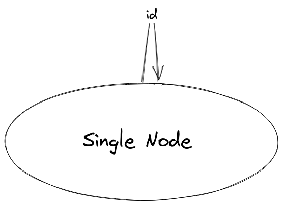
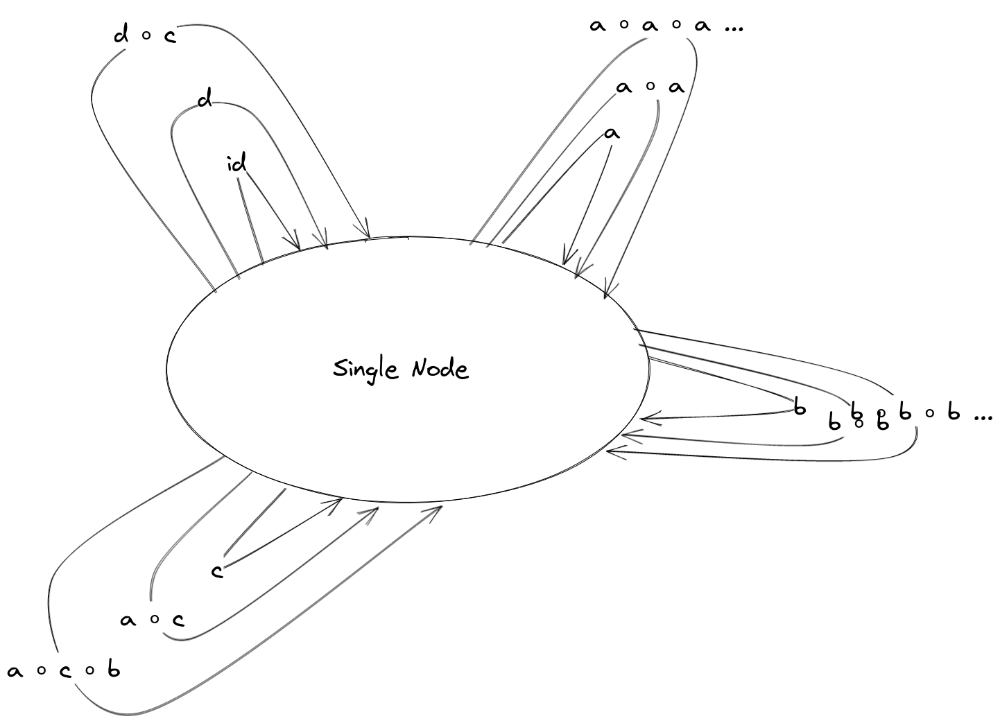
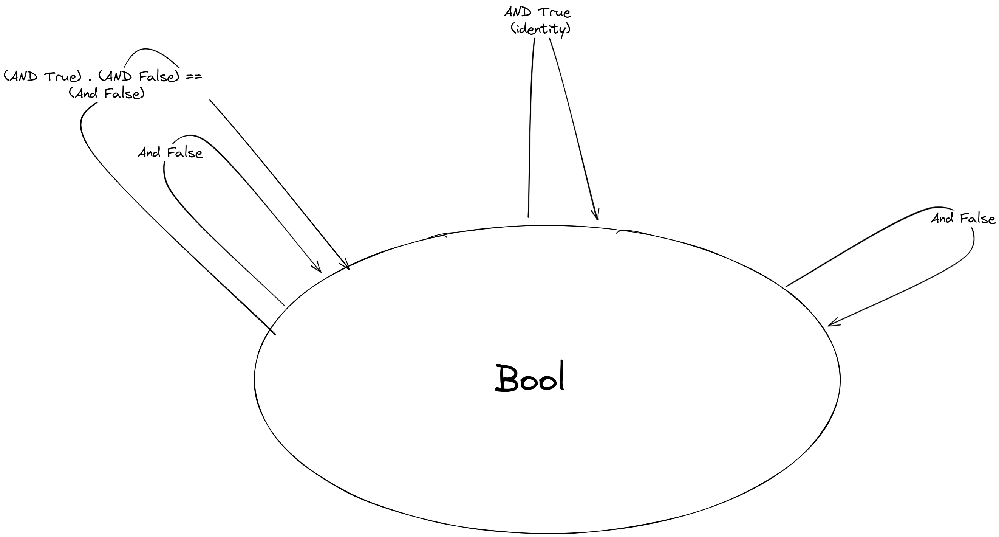
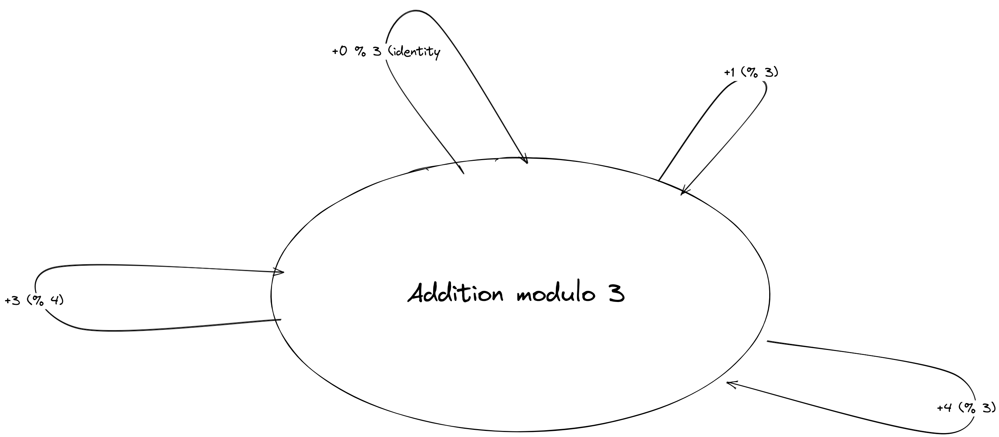

# Category Theory For Programmers Challenges

## 3 Categories Great and Small

### 3.1. Generate a free category from

#### 3.1.1. A graph with one node and no edges



Since each node represents an object in the category, the node must have a self-referencing edge, an identity morphism, `id`

#### 3.1.2. A graph with one node and one (directed) edge (hint: this edge can be composed with itself)

-edge.png)

This is by no means comprehensive as the one edge in this graph can be composed infinitely with itself and the identity morphism of the node (object)

#### 3.1.3 A graph with two nodes and a single arrow between them


Each node (object), will have an identity edge (morphism).

#### 3.1.4. A graph with a single node and 26 arrows marked with the letters of the alphabet: a, b, c ... z



The node will have an identity morphism (edge) with all 26 self-referencing edges tacked onto it. Each of those edges can be composed with themselves and one another to yield an infinite number of edges (morphisms)

### 3.2. What kind of order is this?

#### 3.2.1. A set of sets with the inclusion relation: A is included in B if every element of A is also an element of B

Our morphisms are subset relations. Every set includes itself, A ⊆ A (identity). Inclusions are also composable. A ⊆ B and B ⊆ C implies A ⊆ C (composition). This means that we at least have a preorder (a thin category).

To add to this, If A ⊆ B and B ⊆ A then A = B, that is, A and B are the same set, which means that we at least have a partial order.

Also, because not all objects are a subset of each other though. There are cases of mutual exclusion, for example the singleton set {1} and the duo set {2,3} are not subsets of each other. This means that not all objects are in relation with one another, thus we cannot have a total ordering

#### 3.2.2. C++ types with the following subtyping relation: T1 is a sub-type of T2 if a pointer to T1 can be passed to a function that expects a pointer to T2 without triggering a compilation error

Our morphism is the subtyping relation. In this relation, every type is a subtype of itself (identity). Additionally, subtyping is compositional as if `A` is a subtype of `B` and `B` is a subtype of `C`, then `A` is a subtype of `C`. This means that we have at least a preorder (a thin category)

Furthermore, if `A` is a subtype of `B` and `B` is a subtype of `A`, then `A` and `B` are the same type, thus we know we have at least a partial order. To extrapolate this onto the context of function application, if a function expects a value of type `B`, but we can give it one of type `A` (without a compilation error), and vice versa, then the type `A` is equal to the type `B`.

However, because we cannot relate any two random types in this set with this relation, that is, not all types conform to this relation, for instance, a number type and a string type cannot be subtypes. A function that is expecting a value that inhabits a particular number type cannot be passed a value that inhabits a string type. Thus, we cannot have a total order in this set, but at best a partial order

### 3.3 Considering that Bool is a set of two values True and False, show that it forms two (set-theoretical) monoids with respect to, respectively, operator && (AND) and || (OR)

#### Booleans, under logical and, with a unit element of True

```typescript
// Associativity
(true && false) && true === true && (false && true)

// Closed
true && false === false

// Binary
true && true

// Identity element (true)
let a: boolean;
a && true === a
```

#### Booleans, under logical or, with a unit element of False

```typescript
// Associativity
(true || false) || true === true || (false || true)

// Closed
true || false === true

// Binary
true || true

// Identity element (false)
let a: boolean;
a || false === a
```

### 3.4 Represent the Bool monoid with the AND operator as a category List the morphisms and their rules of composition

```typescript
// Rules of composition

const id = (b: boolean) => b && true
const andFalse = (b: boolean) => b && false

// Unit of composition & composition
id(andFalse(true)) === andFalse

// Associativity
(id(id)) && andFalse == (id(andFalse)) && id

// Composition
andFalse(andFalse) === andFalse
id(id) == id
```



### 3.5 Addition modulo 3 as a monoid category

In Typescript, the modulo operator is denoted as `%`



- **References:** <https://github.com/awalterschulze/category-theory-for-programmers-challenges/blob/main/103-Categories-Great-and-Small.md>
